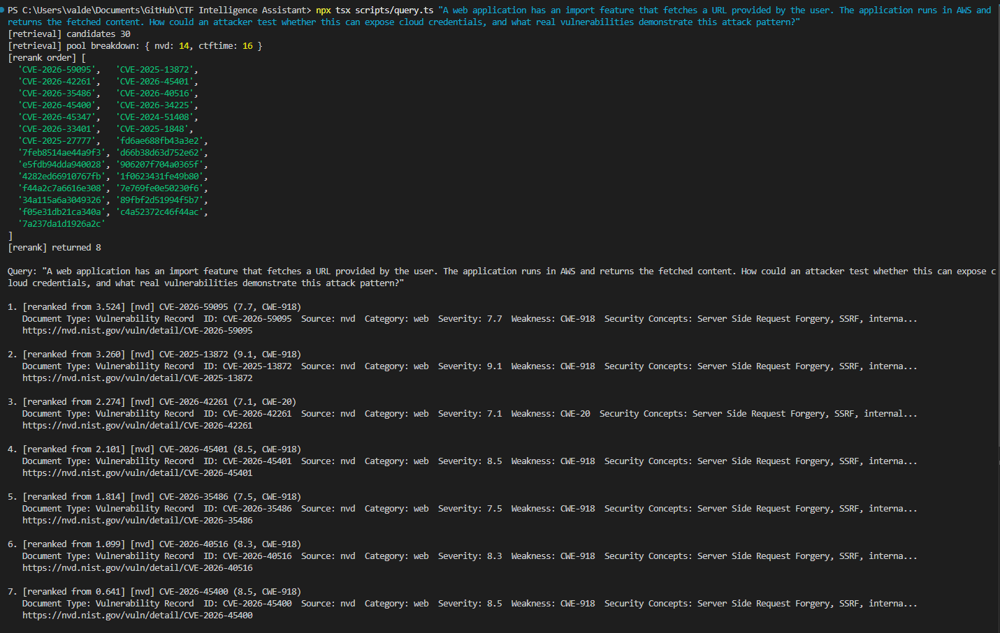

# CTF Intelligence Assistant

A retrieval-augmented research system that grounds CTF/vulnerability-research reasoning in real
CVE records and CTF writeups, rather than relying solely on the model's pretrained knowledge.
Built as a testbed for studying retrieval quality and failure modes over a 137K-chunk corpus
combining formal vulnerability records with practitioner-written CTF writeups (135,839 NVD/CVE
records and 1,456 CTF writeups; the imbalance between these two sources is the main engineering
challenge this project addresses, see Hybrid Retrieval below).

> **Status:** Phase 1 & 2 complete (ingestion, embedding, hybrid retrieval, eval). Phase 3 (UI) deferred.

## Key Results

| Metric | Score | n |
| Faithfulness | 0.827 | 10 |
| Context recall | 0.861 | 6 |
| Context precision | 1.000 | 6 |

Sample sizes differ across metrics (see Honest Caveats below); treat these as directional, not
statistically rigorous.

**The core finding:** retrieval quality was the dominant factor observed during evaluation, outweighing model 
choice and prompt tuning changes. The two largest faithfulness gains during evaluation both came from
fixing retrieval, not from changing the generation model or prompt. Most generation-quality issues traced back 
to retrieval quality rather than model reasoning; one open exception is documented below.

Full breakdown: [`eval/RESULTS.md`](./eval/RESULTS.md) · Debugging narratives: [`ENGINEERING_NOTES.md`](./ENGINEERING_NOTES.md)

## Architecture

```
  NVD/CVE API ─────┐
                 ├──> Transform + Enrichment ──> Chunk ──> Embed ──> Chroma
 GitHub CTF repos ─┘

                                │
                                ▼
                       Hybrid Retrieval
                    (NVD pool + CTF pool,
                   normalized, then merged)
                                │
                                ▼
                           Reranker
                                │
                                ▼
                      Grounded LLM Answer
                        (cited sources)
```

The corpus is embedded using OpenAI's `text-embedding-3-small` model and stored in a
self-hosted Chroma vector database.

NVD provides structured, authoritative metadata (CWE, CVSS, affected software); CTF writeups
provide richer step-by-step exploitation narrative. Because NVD outnumbers CTF writeups roughly
90 to 1, and the two sources produce different embedding-similarity magnitudes for equally
relevant content, retrieval is hybrid with per-pool score normalization rather than a single
combined search, so neither source's size or writing style crowds out the other.

## Demo Output



*Screenshot shows the CLI's retrieval output only (ranked NVD and CTF sources with scores).
Generated, cited answers are shown in this README's Example Query below; the UI layer that
would display both together in one place is Phase 3, deferred.*

## Example Query

```
$ npx tsx scripts/query.ts "web app export feature fetches an internal URL I supply — \
  how could I use this to reach a cloud metadata endpoint?"

Retrieved:
  1. [nvd]      CVE-2024-51408 (8.5, CWE-918) — AppSmith SSRF via New DataSource
  2. [ctftime]  "SSRF to IAM Credential Theft" — Vulnerable-Bank CTF writeup
  3. [nvd]      CVE-2016-0896 (7.3, CWE-254) — 169.254.169.254 bypass

Answer:
  This is server-side request forgery (SSRF) — the export feature makes a
  server-initiated request to an attacker-supplied URL. Pointing that URL at
  169.254.169.254 (the cloud metadata endpoint) can expose instance credentials
  via the Instance Metadata Service, as seen in CVE-2024-51408 [1]. A CTF
  writeup [2] documents the same pattern end-to-end, pivoting from SSRF to
  IAM credential theft...
```

> Note: the CLI currently displays retrieved sources. The UI layer provides generated answers
> alongside the NVD and CTF retrieval results.

## Tech Stack

- **Language:** TypeScript, Python
- **Embeddings:** OpenAI `text-embedding-3-small`
- **Vector database:** Chroma
- **Evaluation:** RAGAS
- **Retrieval:** Hybrid vector retrieval + reranking

## Setup

```bash
npm install
pip install -r eval/requirements.txt --break-system-packages
cp .env.example .env   # fill in OPENAI_API_KEY

npm run ingest         # fetch + transform + merge (NVD + CTF)
npm run chroma         # start local Chroma server (separate terminal)
npm run upsert         # embed + write into Chroma

npx tsx scripts/query.ts "your CTF challenge description here"
```

Requires Node.js + `npx tsx`, Python 3.13, and an OpenAI API key (embedding + generation + RAGAS
judge). Full details, including the `--dry-run` embed flag and eval commands, in the deep dive below.

## Changelog

**2026-07-15**
- Expanded corpus to 137K chunks
- Added CWE-918 (SSRF) enrichment
- Fixed hybrid retrieval score normalization (cross-pool scale mismatch)
- Improved SSRF/UAF benchmark retrieval (0.000 → 0.917 / 1.000 faithfulness)

Full history in [Engineering Notes](./ENGINEERING_NOTES.md#changelog).

---

<details>
<summary><h2>Technical Deep Dive (click to expand)</h2></summary>

### Evaluation

RAGAS-based evaluation, run against the real `retrieve()` + `generateAnswer()` pipeline (not a
synthetic approximation) over a 10-question eval set of realistic CTF-challenge-style prompts.

```bash
npx tsx scripts/eval/export-for-ragas.ts
python eval/run_ragas.py
```

| Source group | Faithfulness |
|---|---|
| NVD-style questions (n=4) | 0.671 |
| CTF-writeup-style questions (n=6) | 0.931 |

**Honest caveats:**
- n=10 is a demo-scale eval, not a statistically rigorous one. Per-question results are noisy at
  this sample size, and which single question scores lowest has flipped across runs.
- `answer_relevancy` is not included. RAGAS 0.4.3 has a broken embeddings wrapper it inherits from
  its own dependency chain.
- One open, unresolved failure: a file-upload-to-RCE question scores 0.000 faithfulness despite
  clean, relevant retrieval. The generation prompt refuses on a genuine match. This is the flip
  side of an earlier fabrication bug (below) and is documented in full in
  [Prompt Grounding Experiments](#prompt-grounding-experiments).
- Fixing retrieval score normalization improved one previously-failing question to 1.000 but
  coincided with a context-recall dip on two others, not yet disambiguated from eval noise.

### Prompt Grounding Experiments

Two incidents while tuning the generation system prompt showed grounding strictness is a real
precision/recall tradeoff in both directions: an under-strict prompt fabricated an answer past a
real retrieval gap (SSRF question, now fixed), and an over-strict prompt refused to answer despite
a genuine, retrieved match (file-upload question, still open). The stricter prompt was kept as the
safer failure mode for this domain, a judgment call, not a solved problem.

Retrieval quality remained the bottleneck even here: the SSRF case stopped being a prompt problem
entirely once retrieval was fixed, while the file-upload case is a genuine generation-side issue
precisely because retrieval is already clean for it. Full incident details in
[Engineering Notes](./ENGINEERING_NOTES.md#grounding-strictness-tradeoff-accepted-not-solved).

### Engineering Notes (summary)

- **SSRF / cloud-metadata retrieval gap (fixed).** Terse CVE descriptions rarely spell out exact
  terms like `169.254.169.254` or provider metadata service names, so narratively-phrased
  questions missed them on both embedding similarity and lexical matching. Fixed by enriching
  CWE-918 chunks with AWS/Azure/GCP metadata-service terminology at the transform layer.
- **UAF retrieval failure (fixed).** NVD's terse text and CTF's narrative prose don't produce
  comparable embedding-similarity magnitudes, so raw cross-pool score comparison systematically
  favored CTF regardless of relevance. Fixed via per-pool z-score normalization before merging.
- Two smaller diagnostic fixes and one undisambiguated side effect are documented in full in
  [`ENGINEERING_NOTES.md`](./ENGINEERING_NOTES.md).

### Architecture Decisions

- **Semantic chunking.** Writeups vary wildly in length; fixed-size chunking loses context.
- **JSONL over a single JSON array for embeddings.** At ~137K chunks x 1536-dim vectors, a single
  `JSON.stringify()`/`parse()` over the whole corpus exceeds V8's string-length ceiling.
- **Chroma over managed vector databases.** Self-hosting avoided external vector-count limits and gave 
  full control during retrieval experiments.
- **Hybrid retrieval with a symmetric floor plus score normalization.** Prevents either pool's
  writing style or size from crowding out the other regardless of actual topical relevance.
- **CWE-918 chunk enrichment.** Pattern is intentionally generalizable to other CWEs, currently
  wired up for CWE-918 only.

### Data Sources

| Source       | Count   | Coverage                                  |
|--------------|---------|--------------------------------------------|
| NVD/CVE      | 135,839 | SQL injection, XSS, buffer overflow, SSRF, LFI, ... |
| CTF writeups | 1,456   | web, pwn, crypto, forensics, rev, misc     |
| **Total**    | **137,284** | |

### Project Structure

```
/ingestion
  /nvd        <- fetch.ts, transform.ts (CWE alias + technique + SSRF enrichment)
  /ctftime    <- scrape.ts, fetch.ts, transform.ts (semantic chunking)
  /embed      <- embed.ts
  /shared     <- schema.ts, dedupe.ts, validate.ts
  run.ts      <- orchestrates fetch -> transform -> merge -> dedupe -> validate
/scripts
  query.ts, debug.ts, start-chroma.ps1, upsert.ts
  /enrichment <- cwe.ts, technique.ts
  /eval       <- generate-answer.ts, export-for-ragas.ts
  /retrieval  <- chroma.ts, hybrid.ts, rerank.ts
/eval         <- run_ragas.py, requirements.txt, RESULTS.md
/data         <- /raw, /chunks, /eval
/ui           <- index.html, styles.css (Phase 3, deferred)
```

### Full Setup Reference

```bash
# Ingestion
npm run ingest              # full pipeline: fetch + transform + merge, both sources
npm run ingest:skip-fetch   # re-transform + re-merge from already-fetched raw data

# Embedding + retrieval
npx tsx ingestion/embed/embed.ts --dry-run   # sanity-check shape, zero API cost
npx tsx ingestion/embed/embed.ts             # real embed, ~$0.50-1 one-time
npm run chroma
npm run upsert
```

> **Note:** the embed script's resumability is keyed by chunk ID, not content hash. After changing
> `transform.ts`'s enrichment logic, delete/move `all.embedded.jsonl` before re-embedding, or
> unchanged IDs will be skipped even though their text changed.

</details>